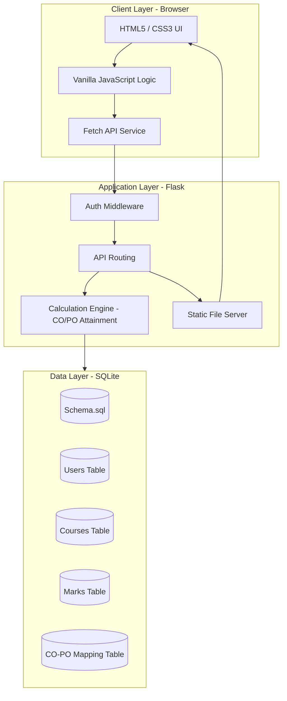

# Project Documentation: Internal Assessment Marks Management System (CO-PO Mapping)

## Abstract
The **Internal Assessment Marks Management System** is a web-based platform designed to automate the process of mapping student marks to **Course Outcomes (CO)** and calculating attainment levels for **Program Outcomes (PO)**. This system aims to streamline the academic audit process by digitizing marks entry and providing real-time analytics to measure student performance against predefined educational objectives. By integrating both Internal Assessments and End Semester Exams (ESE), the system provides a holistic view of undergraduate attainment levels.

---

## Introduction
In modern engineering and technical education, **Outcome-Based Education (OBE)** is essential for maintaining accreditation and ensuring student learning success. Two critical metrics in OBE are **Course Outcomes (CO)** and **Program Outcomes (PO)**. Traditionally, these calculations are performed manually by faculty using complex spreadsheets. The **CO-PO Mapping System** simplifies this by offering a centralized dashboard for faculty to manage courses, configure assessment structures, and instantly generate attainment reports, ensuring accuracy and saving significant administrative time.

---

## Problem Statement
Currently, faculty members face significant challenges in mapping student marks to specific Course Outcomes (COs) and calculating their overall attainment for Program Outcomes (POs). The major issues include:
1.  **Manual Calculation Errors**: The weighted average calculations for Internal Assessments (40%) and End Semester Exams (60%) are prone to errors when done manually.
2.  **Fragmented Data**: Marks for different internals and assignments are often stored in separate files, making it hard to aggregate.
3.  **Inconsistency**: Different departments or faculty members may use slightly different calculation methods.
4.  **Time Consumption**: Generating an attainment report for an entire class takes hours of manual data entry and formula checking.

---

## Existing System
The existing system largely relies on:
- **Manual Logbooks/Ledgers**: Physical entry of marks.
- **Spreadsheets (Excel)**: Individual Excel files maintained by each subject handling faculty.
- **Disconnected Databases**: College-wide databases often only store final marks, missing the granular CO-wise breakdown required for OBE analysis.

---

## Limitations of Existing System
1.  **Lack of Real-time Insight**: Faculty cannot see the attainment status until the end of the semester.
2.  **Difficult to Scale**: Managing attainment across 4+ years and multiple departments is labor-intensive.
3.  **No Automated Visualization**: Spreadsheets don't inherently provide interactive progress bars or visual status updates.
4.  **Static Logic**: Modifying the attainment criteria (e.g., threshold percentages) requires updating every individual spreadsheet.

---

## Proposed Solution
The proposed solution is a centralized **Web Application** built using **Flask (Python)** and **SQLite**. The system provides:
- **Automated Calculations**: Instant calculation of CO attainment based on Internal (70%) and Assignment (30%) performance.
- **Centralized Database**: All course, student, and marks data are stored in a relational database.
- **Dynamic Configuration**: Easy setup of CO counts, Internal assessments, and mapping matrices.
- **Responsive Frontend**: A modern, Excel-like user interface for fast data entry.

---

## Features of Proposed Solution
1.  **Course Management**: Create and manage multiple courses per teacher.
2.  **Flexible CO Pool**: Define the number of COs and their max marks for each internal assessment.
3.  **Excel-like Marks Entry**: Keyboard-friendly interface with keyboard navigation (Tab/Enter) and instant row/column totals.
4.  **Automated Attainment Logic**:
    - **In-semester Assessment (IDA)**: Calculates level (1-3) based on internal tests and assignments.
    - **Direct Assessment (DA)**: Combines IDA (40%) and ESE (60%) to find overall CO levels.
5.  **CO-PO Mapping Matrix**: A 12x14 matrix to map COs to POs and PSOs with correlation levels (1, 2, 3).
6.  **Progress Tracking**: Visual progress bars showing the percentage of marks entered for each internal.
7.  **Export Reports**: Download marks and attainment reports in CSV format for documentation.

---

## Architecture Diagram

---

## System Workflow
1.  **Faculty Login**: Secure authentication using Teacher ID.
2.  **Course Setup**: Define Course Outcomes and Internals structure.
3.  **Student Enrollment**: Upload or manually add student details.
4.  **Marks Entry**: Enter Internal-wise and Component-wise (CO/Assignment) marks.
5.  **Attainment Analysis**: The system automatically pulls marks, applies the formula, and displays CO and PO scores.
6.  **Report Generation**: Export data for academic audits.
